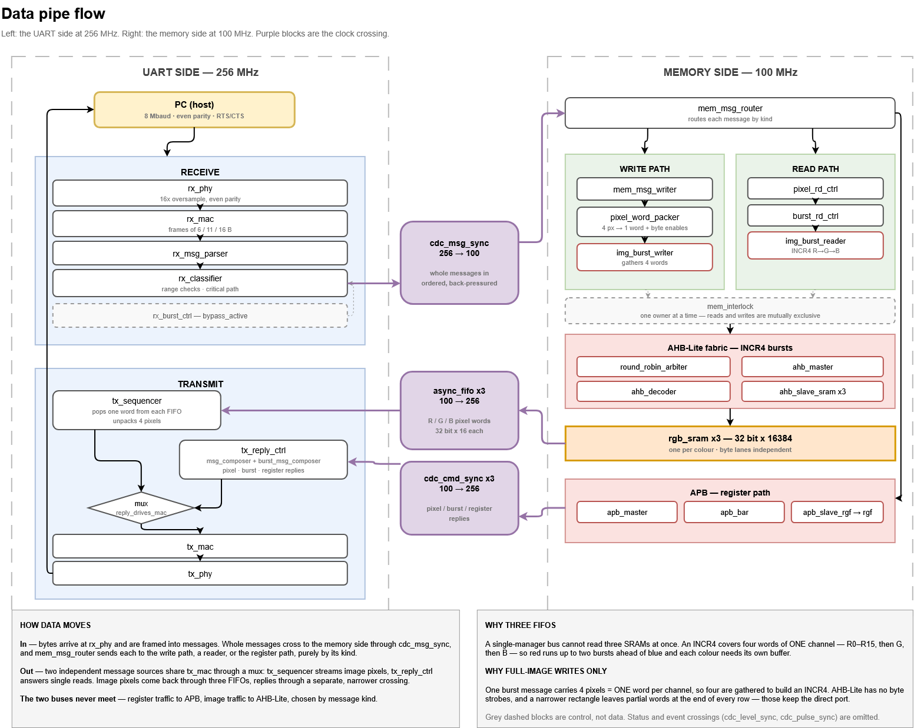
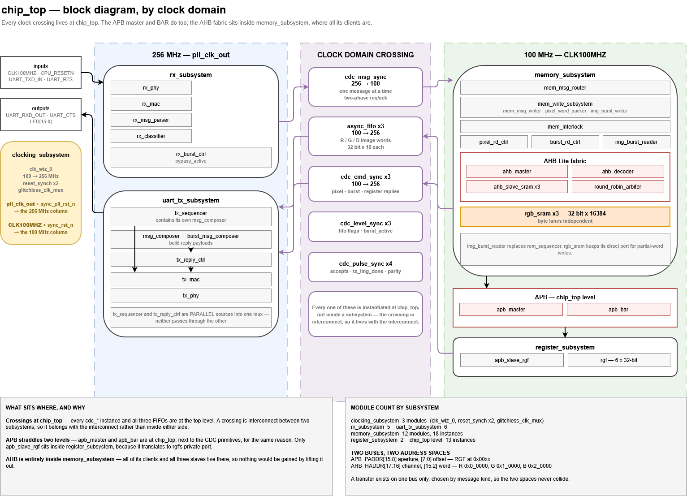

# FPGA RGB Framebuffer over UART

> SystemVerilog implementation of a 256×256 RGB framebuffer on a Nexys A7-100T,
> exchanged with a host over UART with end-to-end flow control. Register access
> runs over **APB**; image memory runs over **AHB-Lite** with INCR4 bursts.
> Verified by unit tests, mutation testing, and hardware validation.

## Features

- 256×256 RGB framebuffer, one SRAM per colour channel
- UART at 8 Mbaud, 8 data bits, even parity, 1 stop, RTS/CTS both directions
- Single pixel write and read
- Burst write and burst read over an arbitrary H×W rectangle
- Full-image write and full-image read
- Register file over APB
- Image memory over AHB-Lite, INCR4 bursts, round-robin across R/G/B
- Two clock domains with every crossing handled explicitly
- Python host tools for upload, capture and regression testing

## Clocking

| Domain | Clock | Owns |
|---|---|---|
| 256 MHz | `pll_clk_out` | UART protocol — framing, parity, classification |
| 100 MHz | `CLK100MHZ` | image geometry, addresses, words |

`clk_wiz_0` generates 256 MHz from the board's 100 MHz: D=5, M=48, CLKOUT0
divide 3.75. At 256 MHz with a divide-by-32 bit period that gives exactly
**8 Mbaud**.

Every clock crossing is instantiated at `chip_top` rather than inside a
subsystem, because a crossing is interconnect between two subsystems:

| Crossing | Carries |
|---|---|
| `cdc_msg_sync` | whole messages, 256 → 100, two-phase req/ack |
| `async_fifo` ×3 | image words back, 100 → 256, one FIFO per colour |
| `cdc_cmd_sync` ×3 | pixel, burst and register replies |
| `cdc_level_sync` ×3 | FIFO flags, `burst_active` |
| `cdc_pulse_sync` ×4 | accepts, `tx_img_done`, parity fault |

## Buses

Two independent buses with separate address spaces. A message reaches one or
the other, chosen by kind, so the two never collide.

**APB — register file.** `apb_master` and `apb_bar` sit at `chip_top` with the
other interconnect; `apb_slave_rgf` lives inside `register_subsystem` because
it translates to `rgf`'s private port.

```
PADDR[15:8]  aperture      RGF at 0x00
PADDR[7:0]   register offset
```

**AHB-Lite — image memory.** The whole fabric is inside `memory_subsystem`,
where all its clients are.

```
HADDR[17:16]  channel   R 0x0_0000   G 0x1_0000   B 0x2_0000
HADDR[15:2]   word index, 16384 per channel
```

Unmapped apertures are answered by a default responder with `HRESP = ERROR`.
Without one, nothing drives `HREADY` and a single bad address would hang the
bus permanently.

## Why three channel FIFOs

A single-manager bus cannot read three SRAMs at once. An INCR4 covers four
words of **one** channel — R0–R15, then G, then B — so red runs up to two
bursts ahead of blue and each colour needs its own buffer. An earlier design
read all three in parallel and needed only one FIFO.

## Why full-image writes only over AHB

One burst message carries 4 pixels, which de-interleave into exactly **one
word per channel**. An INCR4 needs four consecutive words of one channel, so
four messages are gathered first.

AHB-Lite has no byte strobes, and `pixel_word_packer` emits partial words at
the end of every row of a narrower rectangle — the linear address jumps by
`IMG_WIDTH` between rows. Only a full-width rectangle produces complete words
at consecutive addresses. Everything else keeps the direct write port and its
byte enables.

## Architecture



Left is the UART side at 256 MHz, right is the memory side at 100 MHz, and the
purple blocks in the middle are the clock crossing. Data enters at `rx_phy`,
is framed into whole messages, crosses once, and `mem_msg_router` dispatches
each message by kind — write path, a reader, or the register path.

`tx_sequencer` and `tx_reply_ctrl` are **parallel** sources into one mux
(`reply_drives_mac`); neither passes through the other. Image pixels return
through the three channel FIFOs, replies through a separate narrower crossing.



The same design by module hierarchy. Worth noting where each bus sits: the APB
master and BAR are at `chip_top` next to the CDC primitives, and only
`apb_slave_rgf` is inside `register_subsystem`, because it is the only part
that touches `rgf`'s private port. The AHB fabric is entirely inside
`memory_subsystem`, where all of its clients already live.

## Register file

| Offset | Register | Notes |
|---|---|---|
| `0x00` | `IMG_STATUS` | geometry, ready |
| `0x04` | `IMG_TX_MON` | complete/error flags, row/col — **read to clear** |
| `0x08` | `IMG_CTRL` | `start_img_read` |
| `0x0C` | `FIFO_STATUS` | full / empty / almost flags |
| `0x10` | `CLK_CTRL` | `clk_sel` |
| `0x14` | `PARITY_FAULT_CNT` | RX parity faults |

`IMG_TX_MON`'s read-to-clear is qualified by a one-cycle `pc_ren` from
`apb_slave_rgf`. An earlier design decoded it from the address alone, which
forced the message router to park at an unused address between accesses; that
workaround is gone.

## Repository layout

```text
Constraints/            Nexys-A7-100T-Master.xdc
Scripts/                Python host tools
Sources/                SystemVerilog RTL
testbenches/            simulation only
block_diagram.drawio    module hierarchy, by clock domain
block_diagram.png       exported, embedded in this README
data_pipe_flow.drawio   how data moves, and where it crosses clocks
data_pipe_flow.png      exported, embedded in this README
chip_top.bit
README.md
DESIGN.md
```

The `.drawio` files are the editable sources; the `.png` files beside them are
what the README embeds above. Re-export both after changing either diagram, or
the README will quietly go stale.

## Simulation

Ten self-checking testbenches, **187 checks**, all passing. Key paths are
mutation-tested: a deliberate bug is injected and the suite must fail.

| Testbench | Covers |
|---|---|
| `tb_apb_slave_rgf` | APB slave, `pc_ren` strobe |
| `tb_apb_master` | APB FSM, SETUP/ACCESS phases |
| `tb_apb_bar` | decode, default responder, deadlock guard |
| `tb_apb_integration` | router → master → BAR → slave → rgf |
| `tb_ahb_slave_sram` | two-phase write capture, BUSY handling |
| `tb_ahb_master` | INCR4 sequencing, wait states, HRESP |
| `tb_ahb_decoder` | data-phase response mux, two-cycle error |
| `tb_round_robin_arbiter` | fairness at N=3, lock, no preemption |
| `tb_burst_read_path` | full read path, back-pressure, channel skew |
| `tb_burst_write_path` | full write path, gather, equivalence |

`tb_burst_write_path` must be built with **`-DSIMULATION`** — `memory_pkg`
switches to an 8×8 image under that define, and without it the packer strides a
full 256-pixel row between rectangle rows.

## Hardware workflow

**Memory contents come from the bitstream, not from reset.** `INIT_FILE`
values are loaded at configuration; `CPU_RESETN` resets logic only. Any test
that compares against the `.mem` files must run before anything that writes, or
after reprogramming.

### One command

```powershell
cd Scripts
python final_test.py --port COM5
```

Nine stages covering every pipeline, and it **restores the image it started
with** — stage 1 captures the framebuffer before writing anything and stage 8
loads it back, verifying every pixel. That makes it safe to run repeatedly
without reprogramming.

It pauses once, in stage 7: the negative control deliberately overruns the
receive path, so the board needs a reset before the restore. Press RESET, then
Enter.

Expect **26 checks, 0 failed**.

### Or stage by stage

1. Program the FPGA
2. Press reset
3. `board_test` — protocol and memory, compares against `.mem`
4. `flowtest` — flow control under stall, compares against `.mem`
5. `image_tool snapshot` — full read path
6. `image_tool load` — full write path
7. `image_tool rect` — partial-word writes via the direct port
8. `rgf_parking_test` — register path

## Python utilities

All scripts need the baud rate passed explicitly:

```bash
python final_test.py       --port COM5
python board_test.py       --port COM5 --baud 8000000 --width 256 \
                           --init-red red_hex.mem --init-green green_hex.mem \
                           --init-blue blue_hex.mem
python flowtest.py         --port COM5 --baud 8000000 \
                           --init-red red_hex.mem --init-green green_hex.mem \
                           --init-blue blue_hex.mem
python image_tool.py       --port COM5 --baud 8000000 snapshot out.png
python image_tool.py       --port COM5 --baud 8000000 load photo.png
python image_tool.py       --port COM5 --baud 8000000 rect 61 61 10 6 FF0000
python rgf_parking_test.py --port COM5 --baud 8000000 --width 256 --height 256
```

| Script | Purpose |
|---|---|
| `final_test.py` | all nine stages in one run, restores the image afterwards |
| `image_tool.py` | snapshot, load, single pixel, rectangle |
| `board_test.py` | protocol and memory regression |
| `flowtest.py` | RTS/CTS under stall, with a negative control |
| `rgf_parking_test.py` | register path and the `IMG_TX_MON` interlock |

`final_test.py` imports `flowtest.py` as a module, so both must sit in the same
directory. Run it from `Scripts/`.

`flowtest` test 6 is a **negative control**: it repeats the same workload with
flow control disabled and is expected to lose data. If it loses nothing, the
workload never stressed the receive path and the tests above it are untested
rather than passed.

## Implementation results

| | |
|---|---|
| Device | xc7a100t-csg324-1 |
| WNS | 0.022 ns |
| WHS | 0.024 ns |
| Failed routes | 0 |
| Total power | 0.274 W |
| Critical path | `rx_classifier` burst-extent compare, 256 MHz domain |

Two critical warnings remain, both from the Clocking Wizard's in-context XDC
defining a clock on its own input pin. The design's `sys_clk_pin` overrides it;
both describe the same 100 MHz net at the same period.

`SYNTH-15` (byte-wide write enable not inferred) is informational: Vivado
declines the dedicated byte-write pins because the address width of 14 exceeds
its threshold of 12, and falls back to one write enable per RAM. Byte lanes
remain independently writable, which the unaligned-rectangle test confirms.

## Current limitations

- AHB bursts are used for full-image transfers only; smaller rectangles and
  single pixels use the direct port
- Burst origin for a full-image read is fixed at (0,0)
- No burst timeout or abort
- Fixed 256×256 geometry, set at synthesis
- `image_tool --mode stream` is not functional; the decoder assumes burst format

## Future work

- Configurable framebuffer geometry
- Burst recovery and timeout
- 280 MHz UART domain — reachable with an integer MMCM divide (M=42, D=5,
  CLKOUT0 divide 3), but needs another pipeline stage in `rx_classifier` first
- A shared `board_config.py` so the baud rate is not passed by hand
